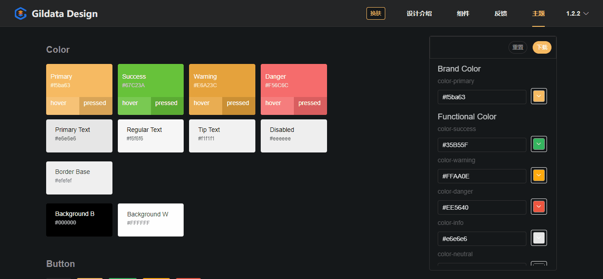

# Gildata Design

## Install

```shell

npm config set registry https://repo.gildata.com/artifactory/api/npm/npmhundsun/

npm install GildataDesign -S
```

## Quick Start

```javascript
import GildataDesign from 'GildataDesign';
import 'GildataDesign/lib/theme-chalk/index.css';

Vue.use(GildataDesign);

// or
import {
  Select,
  Button
  // ...
} from 'GildataDesign';

Vue.component(Select.name, Select);
Vue.component(Button.name, Button);
```

## Browser Support

Modern browsers and Internet Explorer 10+.

## Website

[中文](http://10.106.1.122/gildataDesign/#/zh-CN/component/quickstart)

## Changelog

[更新日志](http://10.106.1.122/gildataDesign/#/zh-CN/component/changelog).

## Custom Theme



## LICENSE

[MIT](LICENSE)
