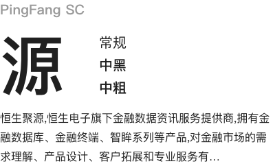
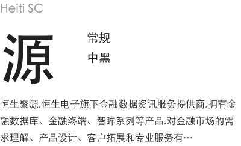
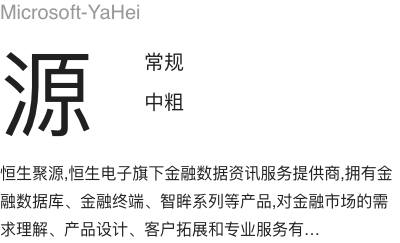
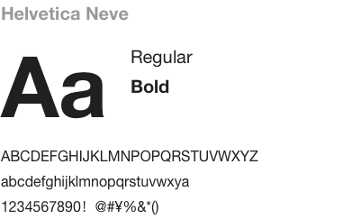
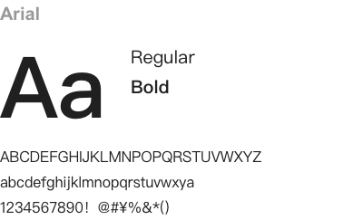
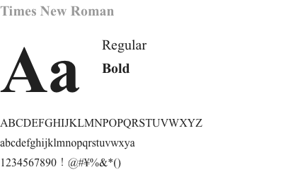

<script>
  import bus from '../../bus';
  import { ACTION_USER_CONFIG_UPDATE } from '../../components/theme/constant.js';
  const varMap = [
    '$--font-size-extra-large',
    '$--font-size-large',
    '$--font-size-medium',
    '$--font-size-base',
    '$--font-size-small',
    '$--font-size-extra-small'
  ];
  const original = {
    'font_size_extra_large': '20px',
    'font_size_large': '18px',
    'font_size_medium': '16px',
    'font_size_base': '14px',
    'font_size_small': '13px',
    'font_size_extra_small': '12px'
  }
  export default {
    created() {
      bus.$on(ACTION_USER_CONFIG_UPDATE, this.setGlobal);
    },
    mounted() {
     Bus.$on('changeTheme', val => {
       this.theme = val;
     }); 
      this.setGlobal();
    },
    methods: {
      tintColor(color, tint) {
        return tintColor(color, tint);
      },
      setGlobal() {
        if (window.userThemeConfig) {
          this.global = window.userThemeConfig.global;
        }
      }
    },
    data() {
      return {
        theme: localStorage.getItem('theme') || 'White',
        global: {},
        'font_size_extra_large': '',
        'font_size_large': '',
        'font_size_medium': '',
        'font_size_base': '',
        'font_size_small': '',
        'font_size_extra_small': ''
      }
    },
    watch: {
      global: {
        immediate: true,
        handler(value) {
          varMap.forEach((v) => {
            const key = v.replace('$--', '').replace(/-/g, '_')
            if (value[v]) {
              this[key] = value[v]
            } else {
              this[key] = original[key]
            }
          });
        }
      }
    },
    computed: {
      fontUrl() {
        return this.theme === 'White' ? require('../../assets/images/term-font2.png') : require('../../assets/images/term-pingfangDark.png');
      },
      lineUrl() {
        return this.theme === 'White' ? require('../../assets/images/term-font1.png') : require('../../assets/images/term-fontDark.png');
      }
    }
  }
</script>

## Typography 字体

<!--
 ### 字体
 <div class="demo-term-box">
   <div class="demo-img-box">
     
   </div>
   <div class="demo-img-box">
     
   </div>
   <div class="demo-img-box">
     
   </div>
   <div class="demo-img-box">
     
   </div>
   <div class="demo-img-box">
     
   </div>
   <div class="demo-img-box">
     
   </div>
 </div>
 -->


### 

<div class="demo-fonts-title">
   <div class="demo-term-title">字号</div>
   <div class="demo-term-title">行高</div>
</div>
<div class="demo-fonts-box">
  <div class="demo-font-box">
    
  </div>
  <div class="demo-font-box">
    
  </div>
</div> 

<!-- 
### Font-family 代码

```css
font-family: "Helvetica Neue",Helvetica,"PingFang SC","Hiragino Sans GB","Microsoft YaHei","微软雅黑",Arial,sans-serif;
```
-->

